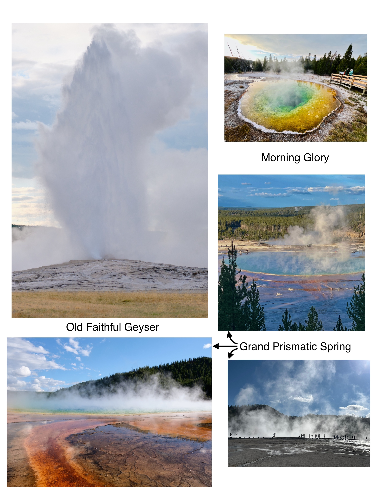

## The Wonders of Yellowstone

After hearing amazing stories about the Yellowstone National Park from friends and colleagues, I finally got to visit it this September, to find out for myself what all the hype was about. And my verdict is that the hype was worth it, as this was the most unique national park I have visited so far! 

Since the national park is huge, I spent about 4 days exploring it, driving along the entire loop, and taking some short hikes. I have never been very enthusiastic about spotting animals in the wild, as I had grown up visiting the zoo in my city frequently, and seeing lots of animals there with very little effort. However, this was the first time I understood the thrill of spotting animals in the wild. The trip started from Grand Teton National Park - I was so excited when I spotted a female moose with her baby moose near Jenny Lake in Grand Teton. After that, I was looking forward to seeing more animals in Yellowstone. The first animal I spotted there was a bison, while walking across the Old Faithful Geyser boardwalk trail. Thereafter, I visited the Lamar Valley and Hayden Valley, where herds of bisons were casually crossing the road or grazing in the pastures. I also saw black bears, grizzly bears, elks, pronghorn deers, and a coyote. I was pleasantly surprised and inspired to see the dedication of visitors to spot the animals - there were many people with powerful scopes, binoculars and super zoom camera lenses! Meanwhile I just had a cheap 50$ pair of binoculars I bought from the visitor center, which I was grateful for, as the grizzly bears and pronghorns were far enough to appear as dots to the naked eye. The enthusiasm of the other visitors was likely a contributing factor to my own enthusiasm as well :D 
Down in Jackson city, I saw a photo gallery of a local photographer, [Thomas Mangelsen](https://www.mangelsen.com/). It was a treat to the eyes to see his stunning photographs of Yellowstone and Grand Teton animals on metal. I especially loved his awesome photos of [Grizzly 399](https://www.mangelsen.com/famous-grizzly-399.html).

Another unique aspect of Yellowstone is the numerous geysers and springs spread across the national park. The Old Faithful Geyser erupts every ~90 minutes into a magnificently tall jet of water -- it was incredible to watch it! There's a boardwalk across it, which goes through dozens of springs of beautiful colors due to microbial activity. I especially loved the Morning Glory. From my Google search, I had seen spectacular photos of Grand Prismatic Spring, and was very eager to see it. However, I discovered that it's hard to see it clearly due to the dense steam rising from it, and it's so big that you can't get a good view of it from the boardwalk. The amazing photos of it are actually captured from a helicopter :D It was a nice stop nevertheless, and I can't complain about the natural free spa! Other interesting spots with hydrothermal features were Mammoth Springs and Norris Geyser.

<figure>

<figcaption>
Animals of Grand Teton and Yellowstone
</figcaption>
</figure>

<figure>

<figcaption>
Geysers and Springs
</figcaption>
</figure>